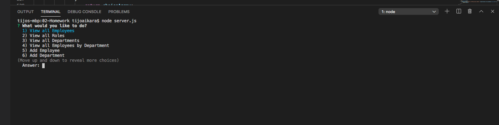
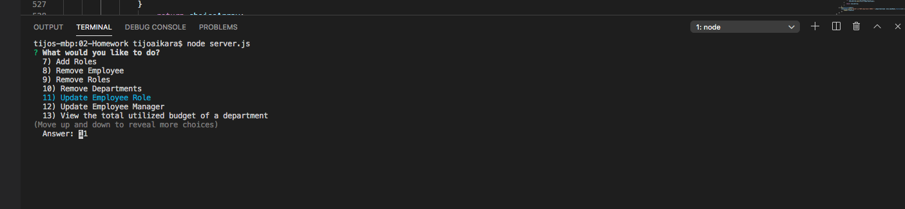
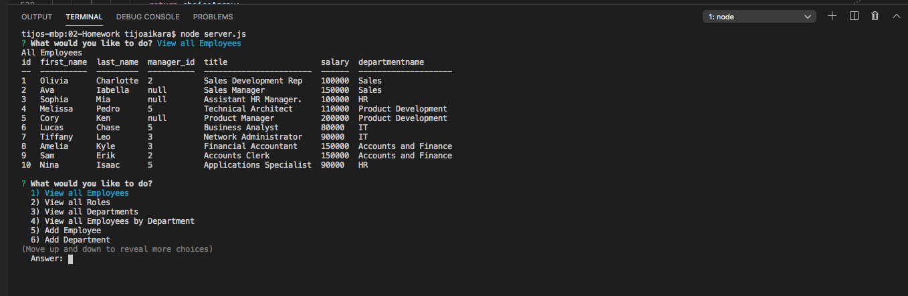
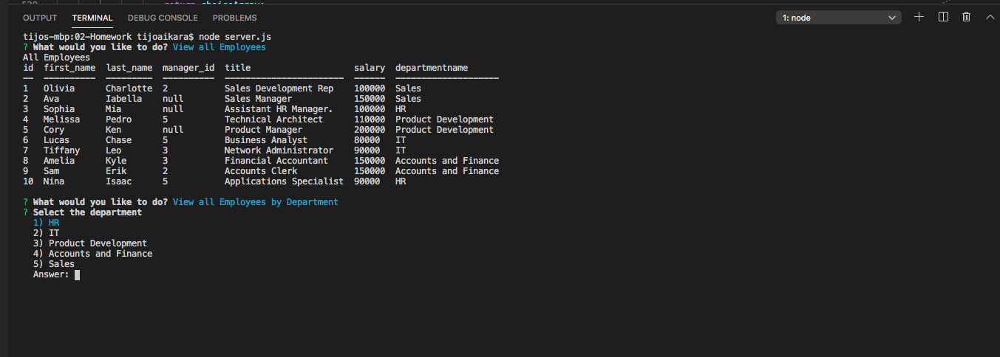
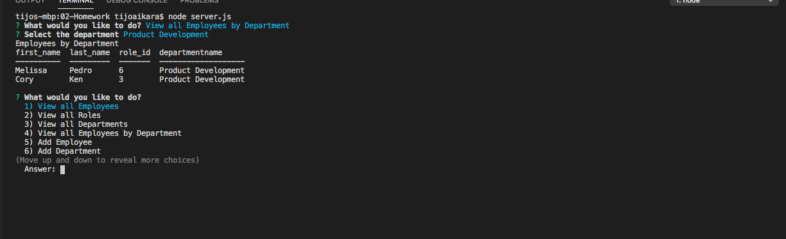
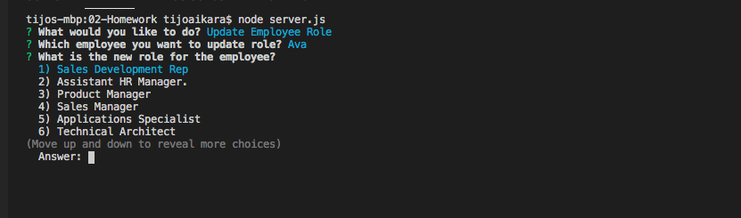
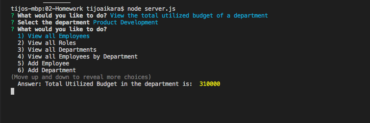

# Employee_Tracker

## Description
This is a command-line application, which can be used to control the information stored in database. Employee tracker application helps a non-developer to view and interact with the database which contains various informations such as employee details, role and various departments in the company.This application uses MySQL NPM package to connect to your MySQL database and perform queries and Inquirer NPM package to interact with the user via the command-line. User can perform the following operations,
* View all Employees
* View all Roles
* View all Departments
* View all Employees by Department
* Add Employee
* Add Department
* Add Roles
* Remove Employee
* Remove Roles
* Remove Departments
* Update Employee Role
* Update Employee Manager
* View the total utilized budget of a department
* Exit

## Table of Contents
* [Installation](#installation)
* [Usage](#usage)

## Installation
Require MySQL, node.js

## Usage

